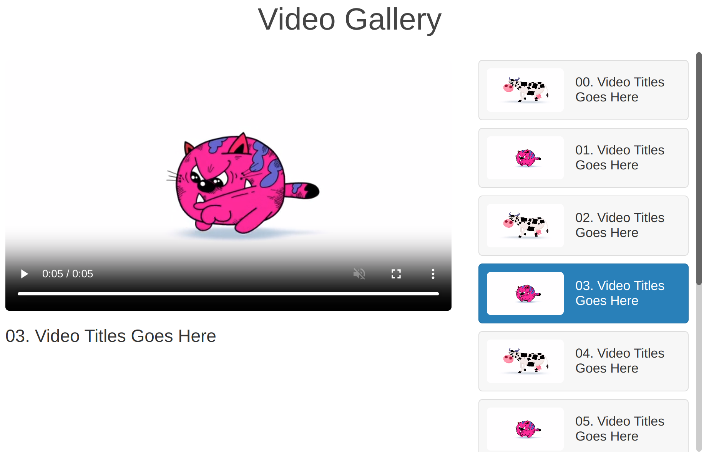

# videos previewer and player

## theory

`<video>` with attributes of `muted`, `control` and `autoplay` to insert videos clips with initial setting.

Generate video-list divs and use `video.onclick` to active and deactive videos.

mouse hover effect is defined in css `vid:hover` style code.

## snapshot

